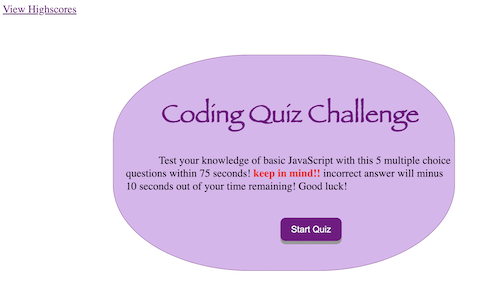
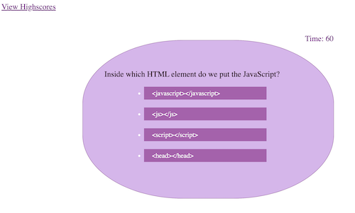
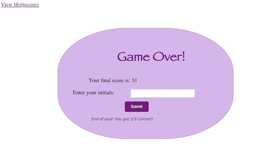
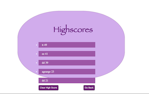
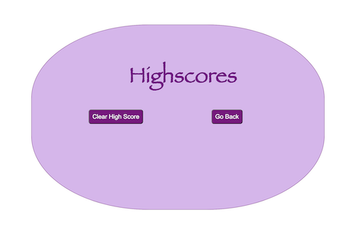

# HW4CodeQuiz
## About The Code Quiz Assignment.
This assignment is about building a timed coding quiz  (on basic JavaScript fundamental) with multiple-choice questions. It's also stores high scores. This app will run in the browser, and will feature dynamically updated HTML and CSS powered by JavaScript code that I created. 
## How the app works?
* When a user clicks the <button>Start Quiz</button> button, the app will present the user with multiple-choice questions, and the timer will start counting down.

 
 

 

* If the user clicks a wrong answer, the timer will be deleted 10 seconds

 

* After the user answered all the questions, the time remaining is the user's score .
* After the user answered all the questions or the timer reaches 0, the game is over.
* After the user answered all the questions, the app will present the user with <strong style="color: purple;">"Game Over!"</strong> page which will show the user's scores and the user will be able to input their initials to be stored along with their scores.

 

* After the user clicks <button>submit</button> button in <strong style="color: purple;">Game Over!</strong> page, the app will present <strong style="color: purple;">Highscores</strong> page which will show the user the previous submitted scores and initials. The page also has <button>Clear High Score </button>button and <button>Go Back</button> button
* The Score also source by high score

 

* <button>Clear high Score</button> button, if the user clicks this button, it will clear all previous submitted scores and initials on the page. 

 

* <button>Go Back</button> button, if the user clicks this button, the app will take the user back to the start page which contains <button>Start Quiz</button> button to start a new game. This page also contains ***View Highscores*** link, when clicked, the app will show the user <strong style="color: purple;">Highscores</strong> page.

## How to create the project?

* Create 2 HTML files, first .HTML contains first page of the game (title, brief explanation of the game, start button and view high score link) and second HTML contains High Scores information (when user clink the link, this page will be presented)
    -  Create CSS file to style the project.
    -  Create 2 JS files, 
    * first .JS contains (codeQuiz.js)
        - 1.  Array variable with objects contained quiz details.fv14
        - 2.  Empty variables for scores and questions value.
        - 3.  Variables that use .querySelector to target Id from HTML (first page HTML)
        - 4.  Variables for function when click
        - 5.  .addEvenListener when click button, timer starts to countdown. 
        - 6.  Function Render that display multiple choice questions
        - 7.  Function compare to compare user selected answer with corrected answer and if/else condition.
        - 8.  If/else condition when questionIndex loop finish running.
        - 9.  Function Game over.
        - 10. variable for time remaining convert to score.
        - 11. variable for label, input, submit button 
        - 12. .addEventListener when click, to submit user's input initials and scores.

    * Second .JS contains (scores.js)
        - 1.  Variables that use .querySelector to target Id from HTML (score.Html page).
        - 2.  .addEventListener to "clear hight scores" button. 
        - 3.  Variable that convert text from local storage into JS object.
        - 4.  Loop for allScores and li for initials input from user.
        - 5.  .addEventListener to "goBack" button when click link back to index.html page.

    ## Author

    * Suthunya Purciful (Sai)

    ## License

    * Not Available

    ## The site is published at 
    - https://saipurciful.github.io/JS-CodeQuiz/